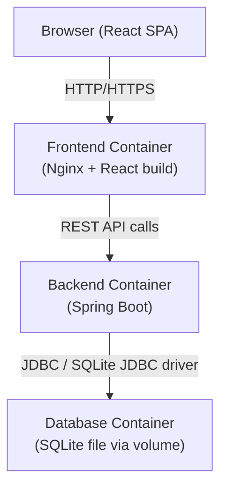
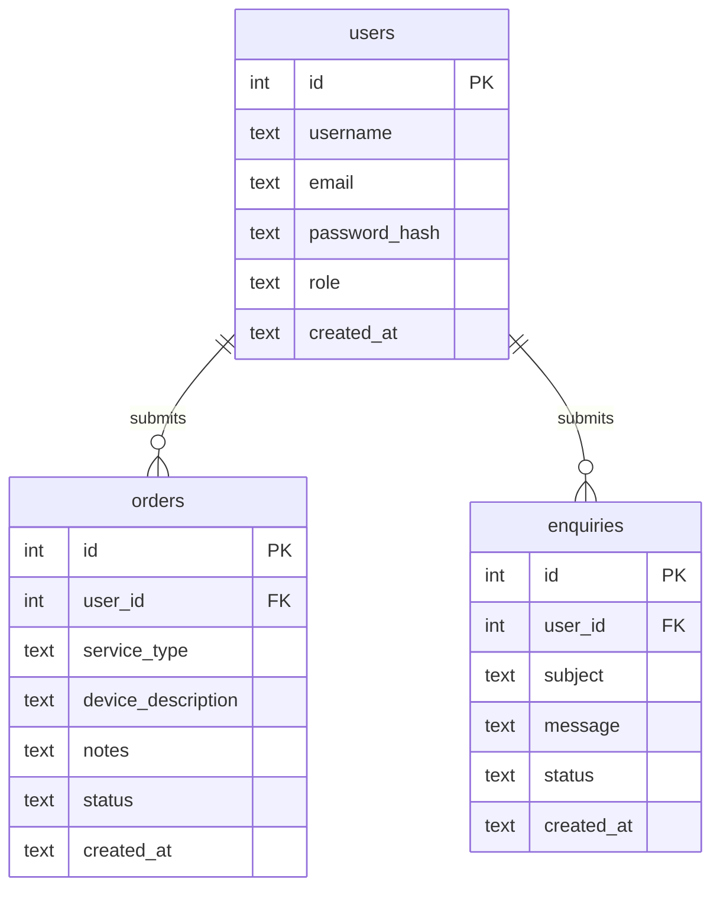

# Design Document

## Overview

The computer-repair-shop is a full-stack web application serving as both a public storefront and a service management system for a laptop and computer repair/trade shop. Visitors can browse services; registered users can submit and track buy, sell, upgrade, repair, and enquiry requests; and a single admin account manages all users, orders, and enquiries.

The system is composed of three Docker containers:
- **Frontend**: React.js SPA served via Nginx
- **Backend**: Spring Boot REST API (Java)
- **Database**: SQLite database with a persistent Docker volume

Authentication is stateless using JWT (signed with HS256). Passwords are hashed with Argon2id. A default admin account (`admin` / `Admin@123`) is seeded on first startup.

---

## Architecture



### Container Topology

| Container | Technology | Port | Notes |
|-----------|-----------|------|-------|
| frontend  | Nginx + React build | 80 / 443 | Serves static assets; proxies `/api` to backend |
| backend   | Spring Boot JAR | 8080 | REST API; connects to DB via JDBC |
| database  | Alpine + SQLite file | — | Exposes volume mount; health-checked by file existence |

### Request Flow

1. Browser loads the React SPA from the frontend container.
2. React makes REST calls to `/api/**` which Nginx reverse-proxies to the backend container.
3. The backend validates the JWT on protected routes, processes business logic, and reads/writes the SQLite database.
4. Responses flow back through the same path.

### Docker Compose Dependency

The backend container declares `depends_on` with a health-check condition on the database container so it does not accept requests until the SQLite file is confirmed present.

---

## Components and Interfaces

### Frontend Components

| Component | Responsibility |
|-----------|---------------|
| `LandingPage` | Public page: shop info, services list, contact details |
| `RegisterForm` | Visitor registration form with client-side validation |
| `LoginForm` | Login form; stores JWT on success |
| `Dashboard` | Authenticated user view: list own orders and enquiries |
| `OrderForm` | Submit a new order (buy/sell/upgrade/repair) |
| `EnquiryForm` | Submit a new enquiry |
| `AdminPanel` | Admin-only view: user list, all orders, all enquiries |
| `AuthContext` | React context holding JWT and current user role |
| `PrivateRoute` | HOC that redirects unauthenticated users to login |
| `AdminRoute` | HOC that returns 403 view for non-admin users |

### Backend REST API

All protected endpoints require `Authorization: Bearer <JWT>` header.

#### Auth Endpoints

| Method | Path | Auth | Description |
|--------|------|------|-------------|
| POST | `/api/auth/register` | None | Register new user |
| POST | `/api/auth/login` | None | Login; returns JWT |
| POST | `/api/auth/change-password` | User/Admin | Change own password |

#### User Endpoints

| Method | Path | Auth | Description |
|--------|------|------|-------------|
| DELETE | `/api/users/me` | User | Delete own account |
| GET | `/api/admin/users` | Admin | Paginated user list |
| DELETE | `/api/admin/users/{id}` | Admin | Delete user by ID |

#### Order Endpoints

| Method | Path | Auth | Description |
|--------|------|------|-------------|
| POST | `/api/orders` | User | Submit new order |
| GET | `/api/orders` | User | Get own orders |
| GET | `/api/admin/orders` | Admin | Paginated all orders |
| PATCH | `/api/admin/orders/{id}/status` | Admin | Update order status |

#### Enquiry Endpoints

| Method | Path | Auth | Description |
|--------|------|------|-------------|
| POST | `/api/enquiries` | User | Submit new enquiry |
| GET | `/api/enquiries` | User | Get own enquiries |
| GET | `/api/admin/enquiries` | Admin | Paginated all enquiries |
| PATCH | `/api/admin/enquiries/{id}/status` | Admin | Update enquiry status |

### Backend Service Layer

| Service | Responsibility |
|---------|---------------|
| `AuthService` | Password hashing (Argon2id), JWT generation and validation |
| `UserService` | User CRUD, cascading deletion of orders and enquiries |
| `OrderService` | Order creation, retrieval, status updates |
| `EnquiryService` | Enquiry creation, retrieval, status updates |
| `AdminSeeder` | Seeds default admin account on startup if absent |

### Security Filter Chain (Spring Security)

```
Request → JwtAuthenticationFilter → SecurityFilterChain → Controller
```

- `JwtAuthenticationFilter`: Extracts and validates JWT; populates `SecurityContext`.
- Public routes: `POST /api/auth/register`, `POST /api/auth/login`, `GET /` (frontend static).
- User routes: require `ROLE_USER` or `ROLE_ADMIN`.
- Admin routes (`/api/admin/**`): require `ROLE_ADMIN`.

---

## Data Models

### Entity: `users`

| Column | Type | Constraints |
|--------|------|-------------|
| `id` | INTEGER | PRIMARY KEY AUTOINCREMENT |
| `username` | TEXT | UNIQUE NOT NULL |
| `email` | TEXT | UNIQUE NOT NULL |
| `password_hash` | TEXT | NOT NULL |
| `role` | TEXT | NOT NULL DEFAULT 'USER' — values: USER, ADMIN |
| `created_at` | TEXT | NOT NULL (ISO-8601 UTC) |

### Entity: `orders`

| Column | Type | Constraints |
|--------|------|-------------|
| `id` | INTEGER | PRIMARY KEY AUTOINCREMENT |
| `user_id` | INTEGER | NOT NULL, FK → users(id) ON DELETE CASCADE |
| `service_type` | TEXT | NOT NULL — values: BUY, SELL, UPGRADE, REPAIR |
| `device_description` | TEXT | NOT NULL |
| `notes` | TEXT | nullable |
| `status` | TEXT | NOT NULL DEFAULT 'Pending' — values: Pending, In Progress, Completed, Cancelled |
| `created_at` | TEXT | NOT NULL (ISO-8601 UTC) |

### Entity: `enquiries`

| Column | Type | Constraints |
|--------|------|-------------|
| `id` | INTEGER | PRIMARY KEY AUTOINCREMENT |
| `user_id` | INTEGER | NOT NULL, FK → users(id) ON DELETE CASCADE |
| `subject` | TEXT | NOT NULL |
| `message` | TEXT | NOT NULL |
| `status` | TEXT | NOT NULL DEFAULT 'Open' — values: Open, In Progress, Resolved, Closed |
| `created_at` | TEXT | NOT NULL (ISO-8601 UTC) |

### ER Diagram



### JWT Payload

```json
{
  "sub": "<username>",
  "userId": "<user_id>",
  "role": "USER | ADMIN",
  "iat": 1700000000,
  "exp": 1700086400
}
```

Token expiry: 24 hours maximum (Requirement 3.4, 9.4).

---

## Correctness Properties

*A property is a characteristic or behavior that should hold true across all valid executions of a system — essentially, a formal statement about what the system should do. Properties serve as the bridge between human-readable specifications and machine-verifiable correctness guarantees.*

### Property 1: Valid registration creates a user

*For any* unique username, valid email address, and password meeting complexity rules, submitting a registration request should succeed and the user should subsequently exist in the system.

**Validates: Requirements 2.1**

---

### Property 2: Duplicate username is rejected

*For any* username that already exists in the system, attempting to register again with that username should return a 409 Conflict response regardless of the email or password provided.

**Validates: Requirements 2.2**

---

### Property 3: Invalid email format is rejected

*For any* string that does not conform to a valid email format (e.g., missing `@`, missing domain), submitting it as the email field during registration should return a 400 Bad Request response.

**Validates: Requirements 2.3**

---

### Property 4: Weak password is rejected

*For any* password string that is fewer than 8 characters, or lacks at least one uppercase letter, one lowercase letter, one digit, or one special character, submitting it during registration or password change should return a 400 Bad Request response.

**Validates: Requirements 2.4, 5.4, 10.4**

---

### Property 5: Passwords are stored as Argon2id hashes

*For any* registered user, the value stored in the `password_hash` column should begin with the Argon2id identifier (`$argon2id$`) and should never equal the plaintext password.

**Validates: Requirements 2.5**

---

### Property 6: Register then login round-trip

*For any* valid registration (unique username, valid email, valid password), the user should be able to immediately log in with those credentials and receive a valid JWT.

**Validates: Requirements 3.1**

---

### Property 7: Invalid credentials return 401

*For any* login attempt using a non-existent username or an incorrect password, the response should be 401 Unauthorized, and the response body should not indicate which field was wrong.

**Validates: Requirements 3.2, 9.3**

---

### Property 8: JWT expiry is at most 24 hours

*For any* JWT issued by the system (user or admin), the difference between the `exp` claim and the `iat` claim should be no greater than 86400 seconds (24 hours).

**Validates: Requirements 3.4, 9.4**

---

### Property 9: Account deletion cascades to all associated records

*For any* user account with any number of orders and enquiries, deleting that account (by the user themselves or by the admin) should result in all associated orders and enquiries also being removed from the database.

**Validates: Requirements 4.2, 11.2**

---

### Property 10: Unauthenticated requests to protected endpoints return 401

*For any* protected endpoint (order submission, enquiry submission, tracking, account deletion, admin endpoints), a request made without a JWT or with a missing Authorization header should return 401 Unauthorized.

**Validates: Requirements 4.3, 6.2, 7.2, 8.4, 11.4**

---

### Property 11: Password change round-trip

*For any* user, after a successful password change to a new valid password, the user should be able to log in with the new password and should no longer be able to log in with the old password.

**Validates: Requirements 5.2**

---

### Property 12: Wrong current password blocks password change

*For any* authenticated user, submitting an incorrect current password to the change-password endpoint should return 401 Unauthorized and leave the stored password unchanged.

**Validates: Requirements 5.3, 10.3**

---

### Property 13: New orders are created with status Pending

*For any* valid order submission (authenticated user, valid service type, non-empty device description), the returned order should have `status = "Pending"` and a non-null unique ID.

**Validates: Requirements 6.1**

---

### Property 14: Orders missing required fields return 400

*For any* order submission where the service type or device description is absent or blank, the response should be 400 Bad Request.

**Validates: Requirements 6.3**

---

### Property 15: New enquiries are created with status Open

*For any* valid enquiry submission (authenticated user, non-empty subject, non-empty message), the returned enquiry should have `status = "Open"` and a non-null unique ID.

**Validates: Requirements 7.1**

---

### Property 16: Enquiries missing required fields return 400

*For any* enquiry submission where the subject or message body is absent or blank, the response should be 400 Bad Request.

**Validates: Requirements 7.3**

---

### Property 17: Users see only their own records

*For any* two distinct users A and B, the orders and enquiries returned to user A should contain only records whose `user_id` matches A, and should never include records belonging to user B.

**Validates: Requirements 8.1, 8.2**

---

### Property 18: Admin JWT contains the ADMIN role claim

*For any* successful admin login, the decoded JWT payload should contain `"role": "ADMIN"`, and this claim should be absent or set to `"USER"` for non-admin JWTs.

**Validates: Requirements 9.2**

---

### Property 19: Admin user list is complete and paginated

*For any* set of N registered users, the admin user list endpoint (across all pages) should return exactly N users with no duplicates and no omissions.

**Validates: Requirements 11.1**

---

### Property 20: Non-admin JWT on admin endpoints returns 403

*For any* request to `/api/admin/**` made with a valid JWT whose role claim is `USER`, the response should be 403 Forbidden.

**Validates: Requirements 11.3**

---

### Property 21: Admin sees all orders and enquiries

*For any* set of orders or enquiries submitted by any combination of users, the admin list endpoints (across all pages) should return all of them with no omissions.

**Validates: Requirements 12.1, 12.2**

---

### Property 22: Status update round-trip for orders and enquiries

*For any* order or enquiry and any valid status value, submitting a status update should persist the new status, and the subsequently retrieved record should reflect the updated status.

**Validates: Requirements 12.3, 12.4**

---

### Property 23: Invalid status value returns 400

*For any* status update request where the status value is not in the allowed set (for orders: Pending/In Progress/Completed/Cancelled; for enquiries: Open/In Progress/Resolved/Closed), the response should be 400 Bad Request.

**Validates: Requirements 12.5**

---

### Property 24: Expired or tampered JWT returns 401

*For any* request to a protected endpoint made with a JWT that is expired or has a modified signature, the response should be 401 Unauthorized.

**Validates: Requirements 13.2, 13.3**

---

### Property 25: Malicious input is sanitized before persistence

*For any* user-supplied string containing SQL injection patterns (e.g., `'; DROP TABLE`) or XSS payloads (e.g., `<script>alert(1)</script>`), the value stored in the database should be the sanitized/escaped form and should not cause unintended query execution.

**Validates: Requirements 13.5**

---

## Error Handling

### HTTP Error Response Format

All backend errors return a consistent JSON body:

```json
{
  "status": 400,
  "error": "Bad Request",
  "message": "Password must be at least 8 characters and contain uppercase, lowercase, digit, and special character.",
  "timestamp": "2024-01-01T12:00:00Z"
}
```

A `@ControllerAdvice` global exception handler maps exceptions to HTTP responses:

| Exception | HTTP Status |
|-----------|------------|
| `ValidationException` | 400 Bad Request |
| `DuplicateUsernameException` | 409 Conflict |
| `AuthenticationException` | 401 Unauthorized |
| `AccessDeniedException` | 403 Forbidden |
| `ResourceNotFoundException` | 404 Not Found |
| `InvalidStatusException` | 400 Bad Request |
| Unhandled `Exception` | 500 Internal Server Error (generic message only) |

### Key Error Handling Rules

- 401 responses for authentication failures must never reveal whether the username or password was wrong (prevents user enumeration).
- 500 responses must not leak stack traces or internal details to the client.
- Input validation errors (400) must include a human-readable `message` describing the violated rule.
- JWT validation failures (expired, bad signature, malformed) all map to 401.

### Frontend Error Handling

- Network errors and non-2xx responses display a user-friendly toast/alert.
- 401 responses automatically clear the stored JWT and redirect to the login page.
- 403 responses display an "Access Denied" message without redirecting.
- Form validation errors are shown inline next to the relevant field.

---

## Testing Strategy

### Dual Testing Approach

Both unit tests and property-based tests are required. They are complementary:
- **Unit tests** verify specific examples, integration points, and edge cases.
- **Property-based tests** verify universal correctness across randomly generated inputs.

### Property-Based Testing

**Library**: [jqwik](https://jqwik.net/) for Java (Spring Boot backend).

Each correctness property defined above must be implemented as a single property-based test using jqwik's `@Property` annotation. Tests must run a minimum of **100 iterations** each.

Tag format for each test:
```
// Feature: computer-repair-shop, Property <N>: <property_text>
```

Example:
```java
// Feature: computer-repair-shop, Property 6: Register then login round-trip
@Property(tries = 100)
void registerThenLoginRoundTrip(@ForAll("validRegistrationData") RegistrationRequest req) {
    authService.register(req);
    LoginResponse response = authService.login(req.username(), req.password());
    assertThat(response.token()).isNotBlank();
}
```

### Unit Testing

**Framework**: JUnit 5 + Mockito (backend); Jest + React Testing Library (frontend).

Unit tests should focus on:
- Specific examples demonstrating correct behavior (e.g., admin seeding on first startup)
- Integration points between service layers
- Edge cases: empty strings, null fields, boundary values (e.g., exactly 8-character password)
- Error conditions: database constraint violations, JWT parsing failures

Avoid writing unit tests that duplicate what property tests already cover broadly.

### Frontend Testing

- React Testing Library for component rendering tests (Properties 1.1, 1.2, 1.3, 8.3).
- Mock the API layer (axios/fetch) to test frontend error handling paths.
- Test `AuthContext` state transitions: login → authenticated, logout → unauthenticated.

### Test Coverage Targets

| Layer | Target |
|-------|--------|
| Backend service layer | ≥ 80% line coverage |
| Backend controllers | ≥ 70% line coverage |
| Frontend components | Key user flows covered |

### Property Test to Design Property Mapping

| Test | Design Property | Requirements |
|------|----------------|-------------|
| `validRegistrationCreatesUser` | Property 1 | 2.1 |
| `duplicateUsernameReturns409` | Property 2 | 2.2 |
| `invalidEmailReturns400` | Property 3 | 2.3 |
| `weakPasswordReturns400` | Property 4 | 2.4, 5.4, 10.4 |
| `passwordStoredAsArgon2id` | Property 5 | 2.5 |
| `registerThenLoginRoundTrip` | Property 6 | 3.1 |
| `invalidCredentialsReturn401` | Property 7 | 3.2, 9.3 |
| `jwtExpiryAtMost24Hours` | Property 8 | 3.4, 9.4 |
| `accountDeletionCascades` | Property 9 | 4.2, 11.2 |
| `unauthenticatedRequestsReturn401` | Property 10 | 4.3, 6.2, 7.2, 8.4, 11.4 |
| `passwordChangeRoundTrip` | Property 11 | 5.2 |
| `wrongCurrentPasswordReturn401` | Property 12 | 5.3, 10.3 |
| `newOrderHasStatusPending` | Property 13 | 6.1 |
| `orderMissingFieldsReturn400` | Property 14 | 6.3 |
| `newEnquiryHasStatusOpen` | Property 15 | 7.1 |
| `enquiryMissingFieldsReturn400` | Property 16 | 7.3 |
| `userSeesOnlyOwnRecords` | Property 17 | 8.1, 8.2 |
| `adminJwtContainsAdminRole` | Property 18 | 9.2 |
| `adminUserListIsComplete` | Property 19 | 11.1 |
| `nonAdminOnAdminEndpointReturns403` | Property 20 | 11.3 |
| `adminSeesAllOrdersAndEnquiries` | Property 21 | 12.1, 12.2 |
| `statusUpdateRoundTrip` | Property 22 | 12.3, 12.4 |
| `invalidStatusReturns400` | Property 23 | 12.5 |
| `expiredOrTamperedJwtReturns401` | Property 24 | 13.2, 13.3 |
| `maliciousInputIsSanitized` | Property 25 | 13.5 |
